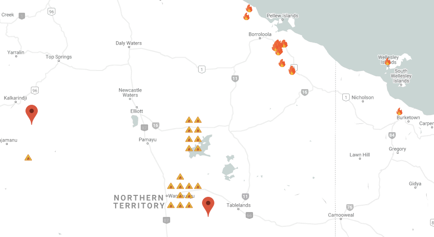

# nasa-space-app-back-end
Submission page: 

[https://2020.spaceappschallenge.org/challenges/confront/spot-fire-3/teams/the-universe-academy/project](https://2020.spaceappschallenge.org/challenges/confront/spot-fire-3/teams/the-universe-academy/project)

Front-end: 

[https://github.com/junwenkwan/nasa-space-app-front-end](https://github.com/junwenkwan/nasa-space-app-front-end)

## Remote Procedure Call (RPC)
To update assets on the server
```bash
POST http://127.0.0.1:5000/update_assets
{'datetime': 'YYYY-MM-DD' }

Response:
{'update_assets': 1}
```
To run neural network prediction
```bash
POST http://127.0.0.1:5000/predict
{'top_left_lat_lng': [x1,y1], 'bottom_right_lat_lng': [x2,y2], 'datetime': 'YYYY-MM-DD' }

Response:
{'class_id': list, 'latitude': list(latitude), 'longitude': list(longitude)}
```

To process FIRMS data
```bash
POST http://127.0.0.1:5000/process_firms_data
{'date': 'YYYY-MM-DD', 'index': int, 'country': 'Australia_NewZealand'}
 
Response:
{'latitude': latitude, 'longitude': longitude, 'bright_ti4': bright_ti4, \
 'track': track, 'date': date, 'time':time, 'confidence': confidence }
```

## Train Neural Network
```bash
python3 training/training_script.py --weights-path ./nn_weight/new.pth \
                                    --csv-path ./dataset/master_dataset.csv     
```                                

## Flask Development
```bash
FLASK_ENV=development FLASK_APP=server.py flask run
```

## AWS EC2
```bash
ssh -i "the-universe-academy.pem" ubuntu@ec2-3-133-101-18.us-east-2.compute.amazonaws.com
```

## Virtual Environment
```bash
python3 -m venv venv && source venv/bin/activate
```
## Front-End Demo
An example of the web app is shown below. The user is able to select two points on the Google map to form a bounding box to detect wildfires in the specific region. Red fire icon indicates the real time Visible Infrared Imaging Radiometer Suite (VIIRS) ground truth retrieved from [NASA EARTHDATA](https://earthdata.nasa.gov/earth-observation-data/near-real-time/download-nrt-data/viirs-nrt). On the other hand, the triangular warning sign indicates the prediction of our neural network within the area of interest.

<div align="center">
<br>
</div>
